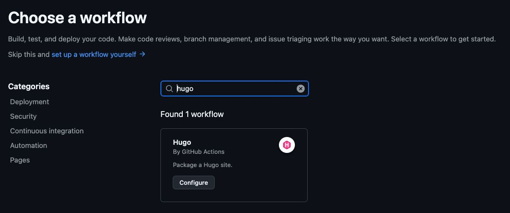

안녕하세요. 오늘은 **GitHub Pages**와 **Hugo**로 블로그를 만들게 된 이유에 대해 이야기해보려고 합니다.

## 들어가며

저는 Tistory, Wordpress 등 여러 블로그 플랫폼을 사용해 보았는데 각각의 장단점이 있었지만, 무엇보다 글을 작성하는 데에 파일을 첨부하거나 헤더를 설정하는 등 GUI를 통한 과정에 피로감을 많이 느끼게 되었습니다. 
그러다가 GitHub Pages와 Hugo의 조합을 알게 되어 정적 블로그를 생성하기로 결정을 했어요.

## GitHub Pages와 Hugo 선택 이유

1. **글쓰기 집중:** Markdown으로 작성하여 마우스 사용을 최소화하고 내용에 집중
2. **Obsidian 연동:** 문서 정리에 주로 이용되는 `Obsidian`에서 바로 게시물 작성 및 관리가 편리
3. **빠른 속도:** Hugo로 만든 정적 사이트는 로딩 속도가 매우 빠름
4. **개발자 친화적:** 버전 관리와 배포가 용이하여 개발자로서 편리함
5. **안정적 접속:** 국내에서 접속 문제 없이 안정적으로 사용 가능
6. **깔끔한 UI:** 광고 없는 깔끔한 인터페이스로 독자들에게 좋은 경험을 제공
7. **빠른 빌드:** Hugo의 빠르고 안정적인 빌드 속도

## Congo 테마

Hugo 테마로 [Congo 테마](https://github.com/jpanther/congo)를 선택했습니다. 심플하면서도 필요한 기능을 모두 갖추고 있어 콘텐츠에 집중하기 좋은 환경을 제공합니다. 읽기 편한 타이포그래피, 다크 모드 지원, 반응형 디자인 등 현대적인 웹 경험을 제공하면서도 콘텐츠에 집중할 수 있는 환경을 만들어줍니다.

 
**사용 방법**

1. 테마 홈페이지 및 데모 페이지를 참고하여 블로그 구조 생성
2. GitHub Repository에 Push (Repository 이름은 `[github-username].github.io`)
3. Repository Settings   Pages > GitHub Actions 활성화 (`Hugo` Workflow 검색)
4. GitHub Actions `Commit`
위 과정을 모두 마치고 main 브랜치로 Commit을 Push 하게 되면 블로그가 배포됩니다. (이미 commit 이 존재하면 최신 커밋 기준으로 1회 배포)

## 마무리

바뀌어가는 계절과 함께 새로운 블로그를 개설하게 되어 마음이 설레이네요. 이 공간이 단순한 개인 기록을 넘어 여러분과 함께 성장하고 배우는 장이 되어주기를 바랍니다. 제 글을 통해 여러분께 작은 영감이라도 드릴 수 있다면 저는 큰 기쁨을 느낄 수 있을거에요. :star-struck:

읽어주셔서 감사합니다.

항상 건강하시고 행복한 하루 보내세요!

<!--### 관련된 문서-->

