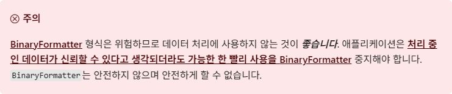

> [MS .NET 8.0](https://learn.microsoft.com/ko-kr/dotnet/standard/serialization/binaryformatter-security-guide)에서의 BinaryFormatter 제거 권고사항

## 들어가며

안녕하세요. 오늘은 업무 중 만나게 된 Legacy 코드에서 발견한 `BinaryFormatter`의 문제점과 해결 방안에 대해 이야기해보려고 합니다.

## BinaryFormatter란?

`BinaryFormatter`는 .NET Framework에서 제공하는 직렬화 클래스로, 객체를 이진 형태로 변환하여 파일에 저장하거나 네트워크를 통해 전송할 수 있게 해주는 기능입니다. 하지만 현재는 보안 문제와 호환성 이슈로 인해 사용이 권장되지 않습니다.

## 실제 개발에서 발생한 문제들

개발 중 기존 모델의 직렬화(Serialize) 및 역직렬화(Deserialize) 과정에서 다양한 오류가 발생한 경험이 있습니다.

### 주요 문제점들

1. **외부 라이브러리 버전 호환성 문제**
   - 외부 라이브러리에서 제공하는 클래스를 직렬화하여 사용하다가, 라이브러리 버전이 업데이트되면서 일부 클래스의 내부 구조가 변경되어 기존에 직렬화된 이진 파일의 역직렬화가 불가능해지는 문제가 발생했습니다.
   - 클래스 이름은 같지만 내부 구현이 달라져 Casting Error가 발생합니다.

2. **프로젝트 구조 변경 시 호환성 문제**
   - 프로젝트 구조 변경이나 코드 리팩터링 과정에서, 이전에 생성된 이진 파일을 새로운 코드에서 읽지 못하는 상황이 발생했습니다.

### BinaryFormatter의 엄격한 요구사항

`System.Runtime.Serialization`의 `BinaryFormatter`는 **다음과 같은 요소를 모두 충족시켜야만 역직렬화가 가능합니다.**

1. **직렬화할 때 사용된 Serializer 클래스의 Assembly 이름**
   - ex: MyApp.Common
2. **직렬화할 때 사용된 Data 클래스의 이름**
   - ex: MyApp.Model
3. **직렬화할 때 사용된 Data 클래스의 Assembly 이름**
   - ex: MyApp.ModelData
4. **직렬화할 때 사용된 Data 클래스의 내부 구조**

#### 클래스 구조 변경 시 문제 예시

다음과 같은 클래스가 존재한다고 가정하고, User 클래스(v1)를 직렬화하여 만든 파일을 User 클래스(v2)로 역직렬화하면 같은 이름이지만 구성요소가 다르기 때문에 오류가 발생합니다.

| User 클래스(v1) | User 클래스(v2) |
| --- | --- |
| 이름 | 이름 |
| 나이 | 나이 |
| `없음` | 성별 |

최근 공개된 직렬화 라이브러리들은 이런 구조 변경에 더 유연하게 대응할 수 있습니다.

### 실제 발생하는 문제들

이처럼 외부 라이브러리나 프로젝트 구조 변경, 코드 리팩터링 등으로 인해 기존 이진 파일을 사용할 수 없는 문제가 실제 개발 과정에서 자주 발생합니다. 또한, 공통 코드를 공유하더라도 환경이나 버전 차이로 인해 역직렬화 오류가 발생할 수 있습니다. 파일 경로 문제(UNC Path 등)로 인해 파일을 찾지 못하는 사례도 있었습니다.

## Microsoft의 공식 권고사항



⚠️ **Microsoft의 보안 경고**

Microsoft에서는 해당 클래스의 사용 중지 원인 중 취약한 보안을 먼저 꼽았지만, 실제로 많은 프로젝트에서 사용하는 데이터는 보안에 민감하지 않은 경우도 많습니다.
→ 보안 문제로 꼽은 예시는 앱 내부에서 DoS 유발, 정보 공개 또는 원격 코드 실행을 유발할 수 있다고 함

### 개발자 관점에서의 문제점

구조가 결정된 설정 파일 등에 대해서는 파일 그 자체를 읽는 것이 효율적이고 안정적인데, 현재는 코드에 대한 의존도가 지나치게 높기 때문에 안정성이 부족하다고 판단됩니다.

BinaryFormatter는 마치 한국어로 작성된 글에 '이 글은 한국어(Serializer Assembly)로 작성된 홍길동(Data Assembly) 작가의 소설책(User Class)이다.'라는 설명이 있어야만 읽을 수 있는 느낌입니다. (클래스 내부의 필드 등도 일치해야 함)

향후 관련된 수정사항이 발생한다면 이러한 코드를 사용하는 로직을 반드시 수정해야할 것으로 보입니다.

## 해결 방안

### 1. DataContract 및 DataMember 사용

- `System.Runtime.Serialization`의 `DataContract`와 `DataMember` 속성을 사용하여 클래스의 멤버를 명시적으로 지정하면, 클래스에 새로운 필드가 추가되더라도 역직렬화 시 기존 데이터와 호환성을 유지할 수 있습니다.
- 예를 들어, 새로운 필드를 추가할 때 `[DataMember(IsRequired = false)]`로 설정하여 기존 데이터에서는 해당 필드가 없더라도 오류가 발생하지 않도록 합니다.

```csharp
[DataContract]
public class Person
{
    [DataMember]
    public string Name { get; set; }

    [DataMember]
    public int Age { get; set; }

    // 새로 추가된 필드
    [DataMember(IsRequired = false, EmitDefaultValue = false)]
    public string Gender { get; set; }
}
```

### 2. 커스텀 직렬화 구현 (ISerializable 인터페이스)

**ISerializable 인터페이스를 구현하여 역직렬화 과정 커스터마이징:**

- `ISerializable`을 구현하면, 역직렬화 시 클래스의 구조 변경을 유연하게 처리할 수 있습니다.
- `GetObjectData` 메서드와 특수 생성자를 구현하여 필요한 필드만 처리하거나, 누락된 필드에 대해 기본값을 설정할 수 있습니다.

```csharp
[Serializable]
public class Person : ISerializable
{
    public string Name { get; set; }
    public int Age { get; set; }
    public string Gender { get; set; }

    // 기본 생성자
    public Person() { }

    // 직렬화용 생성자
    protected Person(SerializationInfo info, StreamingContext context)
    {
        Name = info.GetString("Name");
        Age = info.GetInt32("Age");
        // 새 필드 Gender는 존재하지 않을 수 있으므로 예외 처리
        try
        {
            Gender = info.GetString("Gender");
        }
        catch (SerializationException)
        {
            Gender = "Unknown"; // 기본값 설정
        }
    }

    public void GetObjectData(SerializationInfo info, StreamingContext context)
    {
        info.AddValue("Name", Name);
        info.AddValue("Age", Age);
        info.AddValue("Gender", Gender);
    }
}
```

### 3. 커스텀 SerializationBinder 사용

**SerializationBinder를 통해 타입 매핑 제어:**

- 클래스의 네임스페이스나 어셈블리가 변경된 경우, 커스텀 `SerializationBinder`를 구현하여 역직렬화 시 올바른 타입으로 매핑할 수 있습니다.

```csharp
public class CustomBinder : SerializationBinder
{
    public override Type BindToType(string assemblyName, string typeName)
    {
        if (typeName == "OldNamespace.Person")
        {
            return typeof(NewNamespace.Person);
        }
        return Type.GetType($"{typeName}, {assemblyName}");
    }
}

// 역직렬화 시 사용
BinaryFormatter formatter = new BinaryFormatter();
formatter.Binder = new CustomBinder();
Person person = (Person)formatter.Deserialize(stream);
```

### 4. 데이터 마이그레이션 도구 개발

**기존 이진 파일을 새로운 형식으로 변환:**

- 기존 이진 파일을 읽어들여 새로운 클래스 구조에 맞게 변환한 후 다시 저장하는 마이그레이션 도구를 개발합니다.
- 이를 위해 이전 버전의 클래스 정의를 유지하거나, 별도의 어셈블리를 사용하여 이전 데이터를 역직렬화한 후 새로운 형식으로 재직렬화할 수 있습니다.

```csharp
// 이전 버전 클래스 정의 (별도의 어셈블리 또는 네임스페이스로 관리)
[Serializable]
public class PersonV1
{
    public string Name { get; set; }
    public int Age { get; set; }
}

// 마이그레이션 도구 예시
public void Migrate(string oldFilePath, string newFilePath)
{
    BinaryFormatter oldFormatter = new BinaryFormatter();
    using (FileStream oldStream = new FileStream(oldFilePath, FileMode.Open))
    {
        PersonV1 oldPerson = (PersonV1)oldFormatter.Deserialize(oldStream);
        Person newPerson = new Person
        {
            Name = oldPerson.Name,
            Age = oldPerson.Age,
            Gender = "Unknown" // 기본값 설정
        };

        BinaryFormatter newFormatter = new BinaryFormatter();
        using (FileStream newStream = new FileStream(newFilePath, FileMode.Create))
        {
            newFormatter.Serialize(newStream, newPerson);
        }
    }
}
```

### 5. 대체 직렬화 포맷 고려 (JSON, XML 등)

**텍스트 기반 직렬화 포맷으로 전환:**

- 바이너리 직렬화는 클래스 구조 변경에 민감하므로, JSON이나 XML과 같은 텍스트 기반 직렬화 포맷을 사용하면 구조 변경 시 유연성을 높일 수 있습니다.
- 예를 들어, `System.Text.Json` 또는 `Newtonsoft.Json`을 사용하여 JSON 직렬화를 구현할 수 있습니다. 이러한 포맷은 누락된 필드나 추가된 필드를 자동으로 처리하여 역직렬화 시 오류를 줄여줍니다.

```csharp
using System.Text.Json;

// 직렬화
string jsonString = JsonSerializer.Serialize(person);
File.WriteAllText("person.json", jsonString);

// 역직렬화
string jsonString2 = File.ReadAllText("person.json");
Person person = JsonSerializer.Deserialize<Person>(jsonString2);
```

### 6. Surrogate Serialization 활용

**Serialization Surrogate를 통해 클래스 구조 변경 대응:**

- `ISerializationSurrogate` 인터페이스를 구현하여 특정 타입의 직렬화 및 역직렬화를 커스터마이징할 수 있습니다.
- 이를 통해 기존 이진 데이터의 역직렬화를 새로운 클래스 구조에 맞게 조정할 수 있습니다.

```csharp
public class PersonSurrogate : ISerializationSurrogate
{
    public void GetObjectData(object obj, SerializationInfo info, StreamingContext context)
    {
        Person person = (Person)obj;
        info.AddValue("Name", person.Name);
        info.AddValue("Age", person.Age);
        info.AddValue("Gender", person.Gender);
    }

    public object SetObjectData(object obj, SerializationInfo info, StreamingContext context, ISurrogateSelector selector)
    {
        Person person = (Person)obj;
        person.Name = info.GetString("Name");
        person.Age = info.GetInt32("Age");
        try
        {
            person.Gender = info.GetString("Gender");
        }
        catch (SerializationException)
        {
            person.Gender = "Unknown";
        }
        return person;
    }
}

// Surrogate 설정
SurrogateSelector selector = new SurrogateSelector();
selector.AddSurrogate(typeof(Person), new StreamingContext(StreamingContextStates.All), new PersonSurrogate());

BinaryFormatter formatter = new BinaryFormatter();
formatter.SurrogateSelector = selector;

// 역직렬화
Person person = (Person)formatter.Deserialize(stream);
```

### 7. 기존 클래스 유지 및 호환성 확보

**기존 클래스 버전을 유지하면서 새로운 클래스 추가:**

- 기존 이진 파일을 역직렬화할 때 기존 클래스를 그대로 유지하되, 새로운 기능은 별도의 클래스로 확장할 수 있습니다.
- 이를 통해 기존 데이터를 손상시키지 않으면서 새로운 기능을 추가할 수 있습니다.

```csharp
[Serializable]
public class PersonV1
{
    public string Name { get; set; }
    public int Age { get; set; }
}

[Serializable]
public class PersonV2 : PersonV1
{
    public string Gender { get; set; }
}
```

### 8. 예외 처리 및 디폴트 값 설정

**역직렬화 시 예외 처리 및 기본값 설정:**

- 역직렬화 과정에서 발생할 수 있는 예외를 처리하고, 누락된 필드에 대해 기본값을 설정합니다.
- 이를 통해 클래스 구조 변경 시에도 안정적으로 역직렬화를 수행할 수 있습니다.

```csharp
try
{
    Person person = (Person)formatter.Deserialize(stream);
}
catch (SerializationException ex)
{
    // 예외 처리 및 기본값 설정
    Person person = new Person();
    // 필요한 필드 초기화
}
```

---

## 결론

BinaryFormatter는 .NET에서 오랜 기간 사용되어 왔으나, 구조적 유연성 부족과 보안 취약성, 외부 라이브러리 의존성 등으로 인해 더 이상 권장되지 않습니다. 실제로 다양한 프로젝트에서 발생한 문제들은 클래스 구조 변경, 어셈블리 이름 변경, 외부 라이브러리 업데이트 등으로 인해 기존 이진 파일을 사용할 수 없게 만드는 주요 원인이 되었습니다.

앞으로는 JSON, XML 등 텍스트 기반 직렬화 포맷을 적극적으로 도입하고, 데이터 마이그레이션 및 예외 처리 로직을 강화하는 것이 장기적으로 유지보수성과 안정성을 높이는 길입니다.

읽어주셔서 감사합니다. 항상 건강하시고 행복한 하루 보내세요!

<!--### 관련된 문서-->
